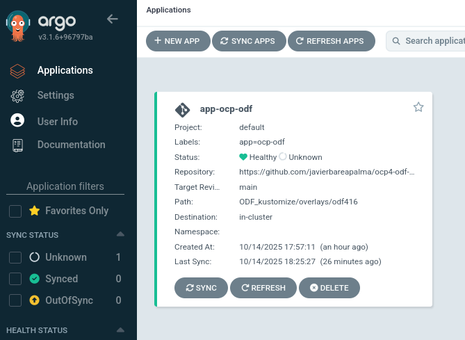

# OpenShift Install

The OpenShift installer `openshift-install` makes it easy to get a cluster
running on the public cloud or your local infrastructure.

To learn more about installing OpenShift, visit [docs.openshift.com](https://docs.openshift.com)
and select the version of OpenShift you are using.

## Installing OCP cluster

To install an OCP cluster (IPI) on AWS, just run:

1. If you want to install the latest version of OCP:
```
./ocp4-install.sh
```

Then, introduce the data that the installer will ask during the execution.

2. If you want to install a specific version of OCP:
```
./ocp4-install.sh 4.16
```

Then, introduce the data that the installer will ask during the execution.

## Installing ODF, classical CLI way

After OCP gets installed, label the worker nodes as follows:

```
oc label node <NodeName> cluster.ocs.openshift.io/openshift-storage=''
```

You will need to add the ODF label to each OCP node that has storage devices used to create the ODF storage cluster. The ODF operator looks for this label to know which nodes can be scheduling targets for ODF components. You must have a minimum of three labeled nodes with the same number of devices or disks with similar performance capability. 

Now, install ODF as a whole..

```
# ./day0ODF/preday0tasks.sh
```

Continue with the right spec.yaml files on behalf of ODF releases.

Like ODF4.16

```
# oc apply -k ./day0ODF/odf416/
```

When finished the Operator installation, go and execute

```
# oc apply -f ./day0ODF/odf416/storagecluster.yaml

```
and wait until CR storagecluster is completely done created.


After, if Ceph Objects-provisioning is needed, continue with 

```
# oc apply -f day1late-RGWstuff/
```

Continue with day2 tasks

```
# ./day2ODF/day2tasks.sh
```


## Installing ODF, kustomize CLI way

Initially, to label the future ODF worker nodes,

```
$ ./day0ODF/preday0tasks.sh
```

Continue with the right spec.yaml files on behalf of ODF releases.

Go to ODF_kustomize directory.

Apply what ODF release you are needing, e.g. 4.16 in this case:

```
ODF_kustomize$ oc apply -k overlays/odf416
```

Likewise, in order to get ODF console

```
$ oc patch console.operator cluster -n openshift-storage --type json -p '[{"op": "add", "path": "/spec/plugins", "value": ["odf-console"]}]'
```

Likewise, in order to get ODF toolbox in ODFv4.15 and above,

```
$ oc patch storageclusters.ocs.openshift.io ocs-storagecluster -n openshift-storage --type json --patch '[{ "op": "replace", "path": "/spec/enableCephTools", "value": true }]'
```


## Installing ODF, gitops-argocd way

I am using same ODF kustomize structure for this purpose.

Before getting into, install 'Red Hat OpenShift GitOps' from OperatorHub.
That deployment creates two projects:
  -openshift-gitops-operator
  -openshift-gitops

together with two objects: 
  -one CR kind:argocd , called 'openshift-gitops'
  -one CR kind:appProject , called 'default'

In order to avoid, not enough permissions to create upcoming CRs, give 'admin' cluster-role creds to user-serviceaccount 'openshift-gitops-argocd-application-controller'

```
$ oc adm policy add-cluster-role-to-user admin  system:serviceaccount:openshift-gitops:openshift-gitops-argocd-application-controller
```

Initially, and in order to deploy first *argocd* Application, locate the right manifest.yaml file, and create/apply it

```
$ oc apply -f application-ocp-odf416.yaml
```



From time to time, and to check whether kustomize files are correct, check with this:

```
oc apply -k ODF_kustomize/overlays/odf416 --dry-run=client
```
